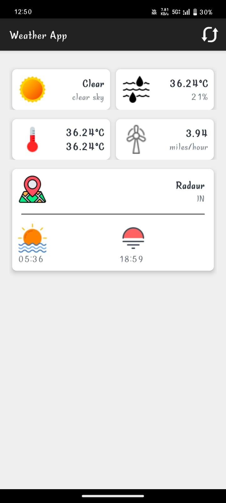

# 🌦️ Weather App (Android + Kotlin)

This is a fully functional **Weather App** built using **Kotlin** and **XML** in **Android Studio**, integrating the **OpenWeather API**. It displays real-time weather data including temperature, humidity, wind speed, and sunrise/sunset timings for any city.

## ✨ Features

- 🌍 Real-time weather data using OpenWeather API
- 📍 Search by city name
- 🌤️ Weather icon and description
- 🌡️ Temperature, humidity, wind speed
- 🌅 Sunrise and 🌇 Sunset times
- 💅 Modern, Material Design-based UI

## 🛠️ Tech Stack

- **Kotlin** (Android language)
- **XML** for UI layout
- **ViewBinding** for efficient view handling
- **OpenWeather API** for weather data
- **Material Design Components** for UI styling

## 📦 Requirements

- Android Studio (Electric Eel or newer recommended)
- Minimum SDK: 21+
- OpenWeather API Key (Free from [https://openweathermap.org/](https://openweathermap.org/))

## 🚀 Screenshots

